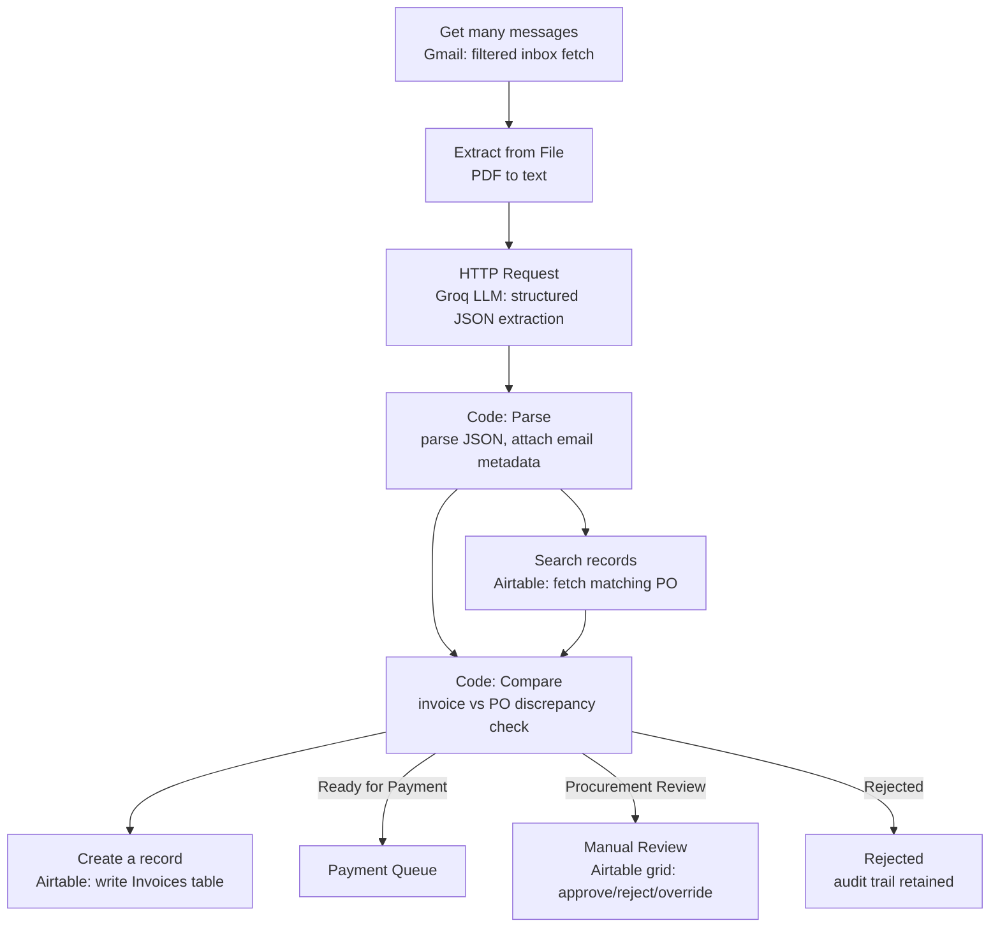

# AI Purchase Order Matching & Invoice Validation

n8n workflow that ingests supplier invoices via email, extracts structured data using an LLM, validates against existing Purchase Orders in Airtable, detects discrepancies, and routes invoices to Ready for Payment / Procurement Review / Rejected.

## Setup Instructions

1. Import the workflow JSON into a self-hosted n8n instance (v1.x).
2. Configure credentials (see Environment Variables / Credentials below).
3. Create an Airtable base with two tables matching the schema in **Database Schema** below: Purchase Orders and Invoices.
4. Populate the Purchase Orders table with at least one approved PO record before running (see Sample Data section for the test PO used).
5. Trigger: this workflow uses a **manual trigger** ("When clicking 'Execute workflow'") for deterministic, repeatable demo execution. See Assumptions for the production trigger design.
6. Test emails must have a PDF invoice attached and the word "invoice" (or "PO"/"purchase") in the subject line, matching the Gmail search filter used in the "Get many messages" node.

## Environment Variables / Credentials Required

| Credential | Used By | Notes |
|---|---|---|
| Gmail OAuth2 | Get many messages | Self-hosted n8n requires your own Google Cloud OAuth client (Client ID + Secret). Add your account under OAuth consent screen → Test users if the app is in "Testing" publishing status. Enable the Gmail API in Google Cloud Console (APIs & Services → Library). |
| Groq API Key | HTTP Request (extraction) | Used via Header Auth: `Authorization: Bearer <key>`. Model used: `openai/gpt-oss-120b`. |
| Airtable Personal Access Token | Search records, Create a record | Requires scopes `data.records:read`, `data.records:write`, **and `schema.bases:read`** (needed for the Base/Table picker to list resources; easy to miss, causes silent 403s otherwise). Grant access at the base level, not just workspace level. |

## Architecture Diagram

## Workflow Explanation

**Get many messages** (Gmail) → filters inbox using `has:attachment filename:pdf subject:(invoice OR PO OR purchase)`, with Simplify off and Download Attachments enabled to retrieve PDF binaries.

**Extract from File** → extracts raw text from each PDF invoice attachment.

**HTTP Request** (Groq) → sends extracted text to an LLM with a prompt requiring strict JSON output: vendor_name, vendor_id, po_number, invoice_number, invoice_date, due_date, currency, net_amount, tax_amount, gross_amount, line_items (array), confidence_score, extraction_warnings. `response_format: json_object` enforced.

**Code in JavaScript (parse)** → parses the LLM's JSON response and attaches email metadata (sender, subject, received date) from the corresponding Gmail item.

**Search records** (Airtable) → looks up the Purchase Order matching the extracted `po_number`.

**Code in JavaScript1 (compare)** → compares invoice fields against the PO record: vendor, PO number, currency, line items (quantity/unit price), and total amount. Produces a `discrepancy_summary` and a `validation_status` (Ready for Payment / Procurement Review / Rejected) based on discrepancy count. Handles the case where no matching PO is found ("Missing Purchase Order" → Rejected).

**Create a record** (Airtable) → writes the full result into the Invoices table: extracted fields, discrepancy summary, validation status, email metadata, timestamps.

**Validation rule used**: 0 discrepancies → Ready for Payment; 1–2 → Procurement Review; 3+ → Rejected. This threshold is a documented business-rule choice per the assignment's allowance for alternative rules, not derived from the spec's suggested logic directly.

**Manual review / approval (Steps 8–9)**: handled directly in the Airtable Invoices table interface. Procurement staff can view extracted data and discrepancy summary, then manually edit Validation Status and Reviewer Comments fields to approve, reject, or override. No separate custom review UI was built; Airtable's native grid/record view serves this function.

## Prompt Design

Extraction prompt sent to Groq (`openai/gpt-oss-120b`, single user message, `response_format: json_object`):

> Extract invoice data from the following text and return ONLY valid JSON with keys: vendor_name, vendor_id, po_number, invoice_number, invoice_date, due_date, currency, net_amount, tax_amount, gross_amount, line_items (array of {item, quantity, unit_price, line_total}), confidence_score (0-1), extraction_warnings (array). No markdown, JSON only.

**Known limitations in this prompt:**
- `confidence_score` has no defined rubric — model returned ≥0.99 on every test case, so treat it as unvalidated rather than a real reliability signal.
- No temperature set (defaults used) — extraction isn't guaranteed deterministic across repeated runs on the same input.
- No field-format spec (date format, currency notation) — acceptable given clean/consistent test data, untested against varied real-world invoice formatting.

## Database Schema

**Purchase Orders**: Vendor, PO Number, Approved Line Items (JSON array string: `[{"item","quantity","unit_price"}]`), Total Amount, Currency, Approval Status.

**Invoices**: Vendor Name, Vendor ID, Purchase Order Number, Invoice Number, Invoice Date, Due Date, Currency, Net Amount, Tax Amount, Gross Amount, Line Items, Purchase Order Match / Discrepancy Summary, Confidence Score, Validation Status, Reviewer Comments, Invoice Attachment, Sender Email, Email Subject, Received At, Last Updated.

## Assumptions & Known Limitations

- **Trigger**: Manual execution used for demo reproducibility. Production implementation would use n8n's Gmail Trigger node (Message Received event) with the same search filter, firing per incoming message. This was built and verified to authenticate and filter correctly, but not adopted for the final submission because it requires reworking the batch-oriented (`.all()[index]`) logic in the Code nodes into single-item-per-execution logic: a change judged too high-risk to make and re-verify within the assignment timeline.
- **Currency mismatch detection**: implemented in the comparison logic (`invoice.currency !== po.Currency`) but not exercised in testing, since all test data uses a single currency (INR).
- **Confidence score**: consistently returned ≥0.99 across all test cases in this submission. The low-confidence branch (e.g., routing low-confidence extractions to manual review) is not implemented as a distinct rule and has not been validated against degraded or ambiguous input (poor OCR, missing fields).
Field comparisons use exact string equality (vendor name, item name, PO number) rather than fuzzy matching — sufficient for this test set but will produce false-positive discrepancies on casing/formatting variance in production data
- **Email metadata alignment**: sender/subject/date are attached to each invoice by matching array index between the Gmail fetch and the parse step. This is correct as long as no item is silently dropped between those two nodes; it has not been stress-tested against a scenario where PDF extraction or LLM extraction fails for one invoice in a multi-invoice batch.
- **Duplicate invoice detection**: not implemented. Re-processing the same invoice email would currently create a duplicate record in Airtable.
- **Invoice Attachment**: not populated. The Airtable Attachments field type only accepts a URL or attachment-array expression in this n8n Airtable node version, not raw binary data directly. A Google Drive upload branch was built and tested as a solution but abandoned: it required a parallel branch off "Extract from File" to preserve binary data, and merging its output (a Drive link) back into the main chain by invoice number required a cross-branch node reference that only resolves reliably after full-workflow execution, with no guaranteed ordering between parallel branches. Production implementation would restructure the chain to carry binary data linearly through to a Drive/S3 upload step before the Airtable write, rather than branching in parallel.
- **Three-way matching (Invoice + PO + Goods Receipt Note)**: not implemented (bonus scope).
- **OCR for scanned invoices**: not implemented; extraction relies on text-based PDFs (Extract from File / PDF text layer), not scanned image invoices.

## Sample Test Data

Three invoices used for testing, all against a single Purchase Order (PO-2026-001, Vendor: TestVendor Ltd, Line Items: Laptop Stand x10 @ ₹1200, Wireless Mouse x20 @ ₹450, Total: ₹21,000):

1. **INV-2026-001**: exact match → Ready for Payment
2. **INV-2026-002**: quantity mismatch (Laptop Stand: 8 vs 10) and unit price mismatch (Wireless Mouse: ₹500 vs ₹450) → Procurement Review
3. **INV-2026-003**: references a nonexistent PO number (PO-2026-999) → Rejected ("Missing Purchase Order")
